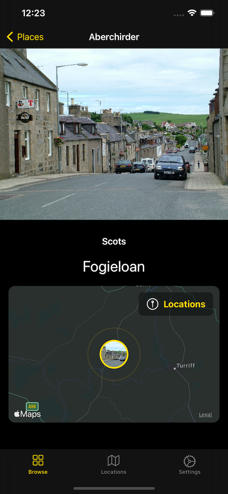

# CTC21 Doric Tiles SwiftUI
## Project Background

Basic SwiftUI app that makes use of the outcomes of the [CTC21 Doric Tiles](https://github.com/CodeTheCity/ctc21-doric-tiles) project as part of [CTC21: Put Your City on the Map](https://codethecity.org/what-we-do/hack-weekends/code-the-city-21-put-your-city-on-the-map/) which ran Saturday 28th Nov 2020 and Sunday 29th Nov 2020. 

The project was about translating place names into Scots - specifically Doric, for the north-east region, but expandable into other dialects of the Scots language for other regionalities.

There is also a view to having a Gaelic language overlay to show and contrast the placenames in Scotland's three national languages.

The app takes those place names and displays them as a list and a map. Where existing, an image related to the place is displayed if it exists in Wikimedia.

## The SwiftUI App

The app is currently developed as an iOS 14 app built using Xcode 12.2 and developed in SwiftUI 2.0.

## Wikidata Query

A SPARQL query has been used for extracting the Wikidata data that is used within the app. The query can be found in the [CTC21 Doric Tiles repo](https://github.com/CodeTheCity/ctc21-doric-tiles/blob/main/sparql/aberdeenshire-places-images.txt) and run via the [Wikidata Query Service](https://query.wikidata.org).
